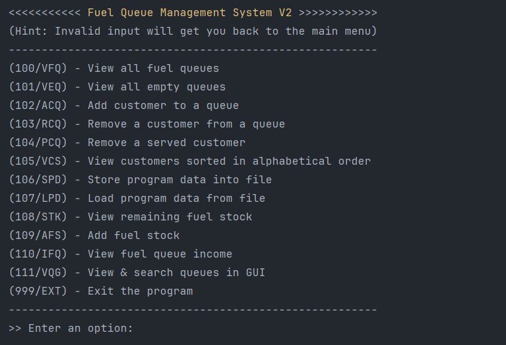
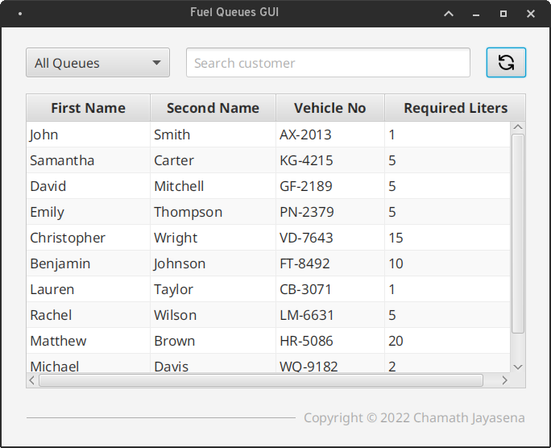

# Fuel Queue Management System

A JavaFX application designed to manage queues with ease. It features a console menu for quick access to all functionalities, 
as well as a modern and user-friendly GUI for a more intuitive experience.


|             Console Menu              |               GUI              |
|:-------------------------------------:|:------------------------------:|
|  |  |

## Features

- Manage customers: Add new customers, remove existing ones, and search for specific customers.
- Fuel queue GUI: View and search the current fuel queues.
- Backup and restore: Create a backup of the system data to prevent data loss and restore it if necessary.
- Circular queue: A queue is implemented as a circular queue, which ensures that customers are served in a fair and efficient manner.

## Usage
1. Clone the repository: 

    ```
    https://github.com/chamajay/queue-management-system.git
    ```

2. Open the project in Intellij IDEA or other Java IDE.
3. Run the project.
